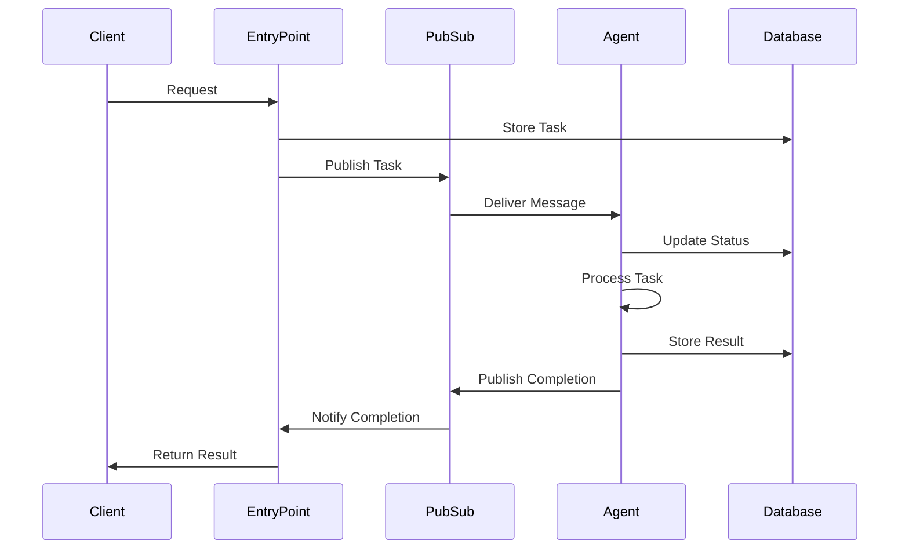

# A2A (Agent-to-Agent) Protocol

The A2A protocol enables structured communication between agents in the Alfred Agent Platform.

## Message Format

### A2A Envelope

The core message structure for agent communication:

```json
{
  "schema_version": "0.4",
  "task_id": "uuid",
  "intent": "TASK_INTENT",
  "role": "assistant",
  "content": {
    // Task-specific payload
  },
  "artifacts": [
    {
      "key": "report",
      "uri": "s3://bucket/file.pdf",
      "mime_type": "application/pdf",
      "description": "Analysis report",
      "metadata": {}
    }
  ],
  "trace_id": "uuid",
  "correlation_id": "parent_task_id",
  "timestamp": "2024-01-01T00:00:00Z",
  "metadata": {},
  "priority": 1,
  "timeout_seconds": 300
}
```

## Standard Intents

### System Intents

- `PING`: Health check
- `STATUS`: Status check
- `CANCEL`: Cancel task

### Business Intents

- `TREND_ANALYSIS`: Analyze trends
- `LEGAL_REVIEW`: Legal compliance check
- `FINANCIAL_ANALYSIS`: Financial analysis
- `SOCIAL_MONITORING`: Social media monitoring

## Message Flow



## Error Handling

Agents should handle errors by:

1. Updating task status to "failed"
2. Storing error message in database
3. Publishing failure event
4. Implementing retry logic for transient errors

## Best Practices

1. Use structured logging with trace IDs
2. Validate message schema before processing
3. Implement timeouts for all operations
4. Store artifacts in durable storage
5. Use correlation IDs for related tasks
